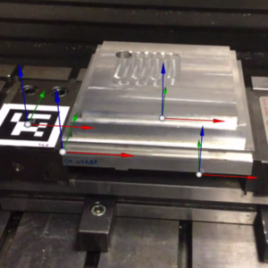
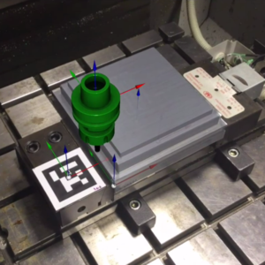
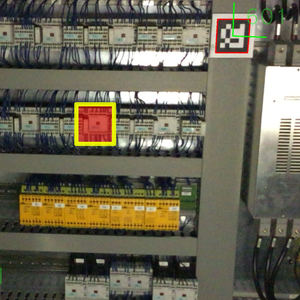
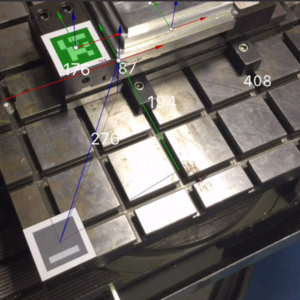
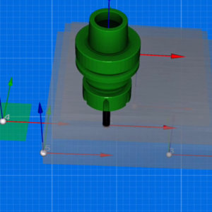
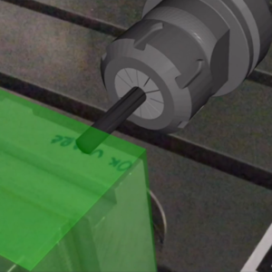

# ARTool

## The missing gear in manufacturing

Go to our [website](http://artool.biz)!

### Mission

**ARTOOL is born from the industrial need to speed up development cycle, bringing augmented reality in manufacturing. Using our proprietary software, the virtual CAMs worlds will enter in the shop floors, reducing from-art-to-part time and increasing efficiency in maintenance workflow, boosting productivity and killing production lead time.**

Debug | Simulate | Maintenance
------|----------|------------
 |  | 
Debug the origin definitions of the CNC. The Augmented Reality device is directly connected to the controller | Simulate the trajectory defined in your part program against the real working area | Find the failed components and order them online if necessary; no need to inspect complex schematics

Measure | Inspection | Collision
--------|------------|----------
 |  | 
3D precise measuring tool, that is extremely fast that allows you to use machine origins, for shop-floor written code | Inspect the scene and check your CAM design against in machine defined origins | Identify catastrophic collisions and guarantee machine survival against your youngest technician

 * Advanced Capabilities:
   [](https://www.youtube.com/watch?v=xXRnwa-9-0Y)
 * Time saving solutions:
   [](https://www.youtube.com/watch?v=1pzIEYxGHsQ)

### Team

| Amedeo Setti | Paolo Bosetti | Matteo Ragni |
|--------------|---------------|--------------|
|  |  |  |
| Mechatronics engineer, Leading Software Developer,Business manager | Ph.D. in Materials Engineering, Prof. in Manufacturing @ UniTrento, Expert in Manufacturing | Mechatronics engineer, Ph.D. Candidate @ UniTrento, Software Developer |

### Awards

 > 
 >
 > 28th October, 2015 — During D2T - Start Cup 2015 promoted by Trentino Sviluppo, ARTOOL won the Unicredit Start Lab Special Price. ARTOOL enters in the UniCredit accelerated program, that collects the best enterprise idea that are boosted through the direct access to the Startup Academy and a dedicated coaching program.
 >
 > [Read More](https://www.unicreditstartlab.eu/it/startlab/attivita/news/PremiospecialeTrentinoSviluppo.html)

### Contacts

Visit us:
```
Polo scientifico tecnologico Fabio Ferrari
Dipartimento Ingegneria Indutriale
Sommarive, 9
Trento, TN
38123-IT
```

 * [Website](http://artool.biz)
 * [Mail Us](mailto:info@artool.biz)
 * [Blog](http://blog.artool.biz/)
 * [Github](https://github.com/artoolbiz)
 * [Youtube](https://www.youtube.com/channel/UCMAHnoT74f7ziPmp0Iewg1w)
